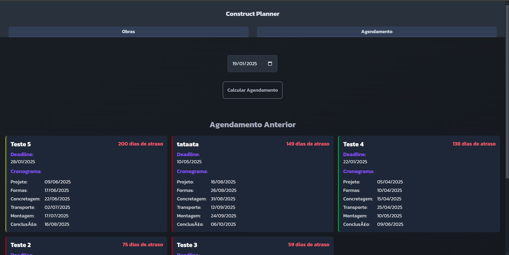

# Construct Planner

**Número da Lista**: 33 
**Conteúdo da Disciplina**: Greed 

## Alunos
| Matrícula | Aluno                       |
|-----------|-----------------------------|
| 202046087 | Fabrício Macedo de Queiroz  |
| 202046004 | Caio Moreira Sulz Gonsalves |

## Sobre

O Construct Planner é um projeto de cadastro de obras com o objetivo de analisar e controlar o tempo de contrução total de uma obra, visando diminuir seu tempo de atraso.
Cada obra possui etapas que demoram dias para serem concluídas:
- Projeto
- Formas
- Concretagem
- Transporte
- Montagem

Após conceder informações da duração em dias de cada etapa, o usuário é capaz de visualizar na tela de agendamentos os detalhes da obra e seu tempo de atraso (se existir).

## Linguagens/Frameworks

<table style="border: none; text-align: center;">
    <tr>
        <td>
            <strong>C#</strong>
        </td>
        <td>
            <strong>Blazor Web Assembly</strong>
        </td>
        <td>
            <strong>Asp Net Core</strong>
        </td>
    </tr>
    <tr>
        <td>
            
        </td>
        <td>
            
</a>
        </td>
        <td>
            
        </td>
        
</table>

## Uso / Manual de como Rodar

## Screenshots

    
Home 

        
    

    
Cadastro 

        
    

    
Agendamentos 

        
    

## Vídeos Explicando o Projeto

