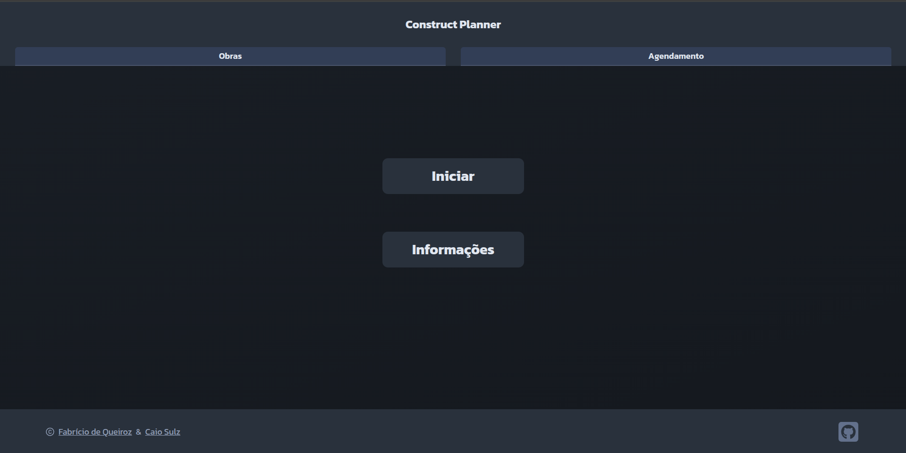
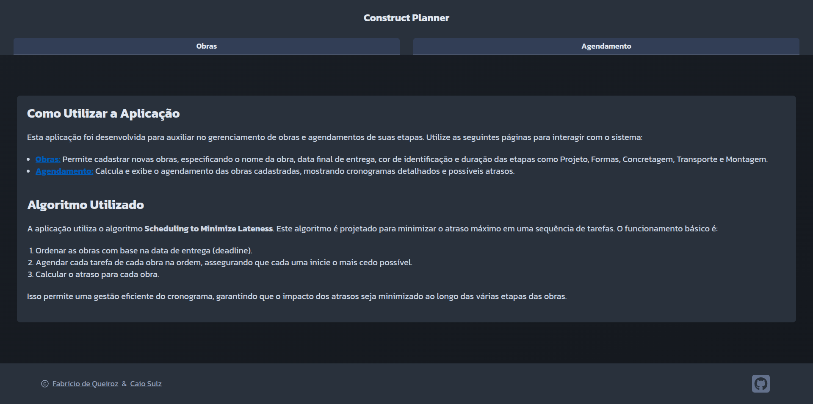
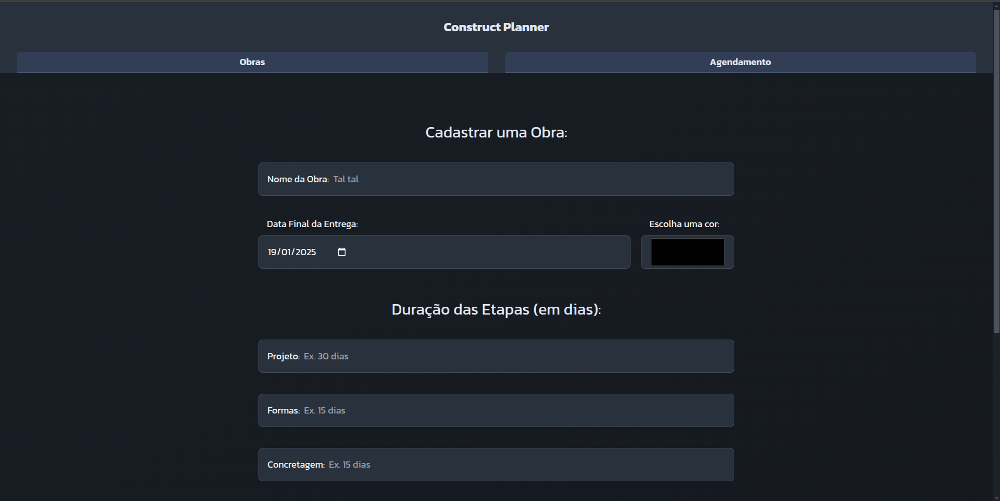
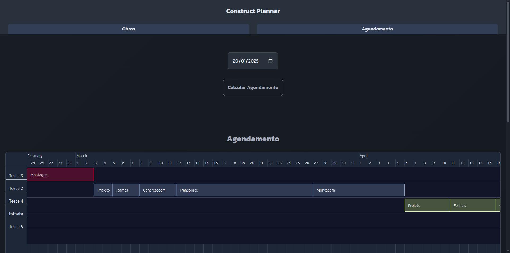
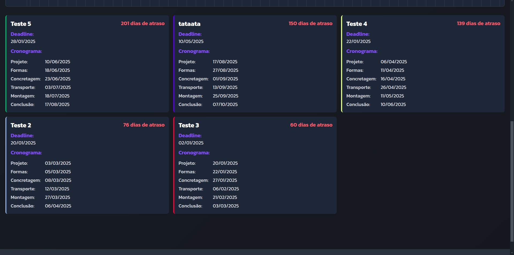

# Construct Planner

**Número da Lista**: 33<br>
**Conteúdo da Disciplina**: Greed<br>

## Alunos
| Matrícula | Aluno                       |
|-----------|-----------------------------|
| 202046087 | Fabrício Macedo de Queiroz  |
| 202046004 | Caio Moreira Sulz Gonsalves |


# Sobre

O **Construct Planner** é uma aplicação web desenvolvida para auxiliar no cadastro e gerenciamento de obras, com o objetivo principal de analisar e controlar o tempo total de construção, minimizando atrasos. A aplicação oferece uma abordagem estruturada para a gestão de cada etapa da obra, garantindo uma melhor previsão e controle de cronogramas.

## Etapas da Obra

Cada obra cadastrada no sistema passa por diversas etapas, que demandam dias para serem concluídas. Sendo elas:

- Desenvolvimento do **Projeto**
- Montagem das **Formas**
- **Concretagem** das Formas
- **Transporte** das Peças
- **Montagem** da Obra

## Funcionalidades

Após o usuário cadastrar às Obras, o sistema permite:

- **Visualização de Detalhes**: Na tela de Agendamentos, é possível visualizar os cronogramas detalhados de cada obra.
- **Análise de Atrasos**: Identificação de atrasos em dias de cada Obra, permitindo um melhor planejamento e tomada de decisões acerca de aceitar novas obras ou finalizar as existentes.

Utilizando o algoritmo **Scheduling to Minimize Lateness**, a aplicação ajuda a minimizar o atraso máximo na sequência de Obras que precisam ser concluídas. Isso assegura que cada etapa seja iniciada o mais cedo possível e contribui para uma gestão eficiente do cronograma das Obras.

## Screenshots

<center>

<div>
    <p>Home
        
    </p>
    <p>Informações
        
    </p>
    <p>Cadastro de Obras
        
    </p>
    <p>Agendamento - Timeline
        
    </p>
    <p>Agendamento - Cards
        
    </p>
</div>

</center>


## Linguagens/Frameworks

<table style="border: none; text-align: center; width: 100%; height: fit-content;">
    <tr>
        <td>
            <strong>C#</strong>
        </td>
        <td>
            <strong>Blazor WebAssembly</strong>
        </td>
        <td>
            <strong>ASP .NET Core</strong>
        </td>
    </tr>
    <tr>
        <td style="vertical-align: middle;">
            <a href="https://skillicons.dev">
                
            </a>
        </td>
        <td style="vertical-align: middle;">
            
        </td>
        <td style="vertical-align: middle;">
            <a href="https://skillicons.dev">
                
            </a>
        </td>
    </tr>
    <tr>
        <td>
            Linguagem
        </td>
        <td>
            Frontend
        </td>
        <td>
            Backend
        </td>
    </tr>
</table>

# Uso

## Acesso à Aplicação

Você pode acessar a aplicação pelo seguinte link: [Construct Planner](https://construct-planner.pages.dev/)

Esta aplicação foi desenvolvida para auxiliar no gerenciamento de obras e agendamentos de suas etapas. Utilize as seguintes páginas para interagir com o sistema:

## Obras

Nesta página, você pode cadastrar novas obras. Para cada obra, é necessário especificar os seguintes detalhes:

- **Nome da Obra**: Identificação da obra.
- **Data Final de Entrega**: A data prevista para a conclusão da obra.
- **Cor de Identificação**: Uma cor para facilitar a visualização e distinção das obras no Agendamento.
- **Duração das Etapas**: Especifique a duração das seguintes etapas (em dias):
    - **Projeto**
    - **Formas**
    - **Concretagem**
    - **Transporte**
    - **Montagem**

## Agendamento

Nesta página, o sistema calcula e exibe o agendamento das obras cadastradas. Os seguintes detalhes são apresentados:

- **Cronogramas Detalhados**: Visualize o cronograma completo de cada obra.
- **Possíveis Atrasos**: Identifique obras que sofreram atrasos e obras que foram concluídas no prazo.

## Algoritmo Utilizado

A aplicação utiliza o algoritmo **Scheduling to Minimize Lateness**. Este algoritmo é projetado para minimizar o atraso máximo em uma sequência de tarefas. O funcionamento básico é o seguinte:

1. **Ordenação das Obras**: As obras são ordenadas com base na data de entrega (deadline).
2. **Agendamento das Tarefas**: Cada tarefa de cada obra é agendada na ordem, assegurando que cada uma inicie o mais cedo possível.
3. **Cálculo do Atraso**: O atraso para cada obra é calculado.

Este processo permite uma gestão eficiente do cronograma, garantindo que o impacto dos atrasos seja minimizado ao longo das várias etapas das obras.


# Manual de como Rodar Localmente

Este guia explica como configurar e rodar localmente um projeto Blazor WebAssembly para o Frontend e um projeto ASP.NET Core para o Backend. Siga as instruções abaixo para preparar o ambiente.

## Pré-requisitos

1. **.NET SDK**: Certifique-se de que o [SDK do .NET](https://dotnet.microsoft.com/en-us/download/dotnet) está instalado.

    - Após a instalação, verifique se o .NET está funcionando corretamente rodando:
      ```bash
      dotnet --version
      ```
      Esse comando verifica se você possui o .NET SDK instalado corretamente.

2. **Editor de Código (opcional)**: É recomendável ter o [Visual Studio Code](https://code.visualstudio.com/) ou o [Visual Studio](https://visualstudio.microsoft.com/) instalado para facilitar o desenvolvimento e a execução do projeto.

3. **Navegador Compatível**: Para executar o projeto Blazor WebAssembly, você precisará de um navegador moderno como Google Chrome, Microsoft Edge, ou Mozilla Firefox.

## Instruções para Rodar

### Passos Comuns

1. **Clone o Repositório**: Clone o repositório do projeto que contém o Blazor WebAssembly e o ASP.NET Core.

   ```bash
   git clone https://github.com/projeto-de-algoritmos-2024/Greed_ConstructPlanner.git
   ```

2. **Navegue até a Pasta do Projeto**: Entre na pasta do projeto que contém os dois projetos (frontend e backend).

   ```bash
   cd Greed_ConstructPlanner
   ```

### Rodando o Projeto Blazor WebAssembly (Frontend)

1. **Navegue para a Pasta do Projeto Blazor WebAssembly**:

   ```bash
   cd ConstructPlannerFront
   ```

2. **Restaurar Dependências**: Execute o comando para restaurar as dependências do projeto.

   ```bash
   dotnet restore
   ```

3. **Rodar o Projeto**: Execute o comando para iniciar o servidor de desenvolvimento.

   ```bash
   dotnet run
   ```

4. **Acessar o Frontend**: O projeto será servido em uma URL local (geralmente algo como `https://localhost:5254`). Abra essa URL em seu navegador.

### Rodando o Projeto ASP .NET Core (Backend)

1. **Navegue para a Pasta do Projeto ASP.NET Core** (a partir da raiz do repositório):

   ```bash
   cd 'Construct Planner API'
   ```

2. **Restaurar Dependências**: Execute o comando para restaurar as dependências do projeto.

   ```bash
   dotnet restore
   ```

3. **Rodar o Projeto**: Execute o comando para iniciar o servidor backend.

   ```bash
   dotnet run
   ```

4. **Acessar o Backend**: O backend estará disponível em uma URL local (geralmente algo como `https://localhost:8080`).

---

Este guia fornece as etapas essenciais para rodar um projeto Blazor WebAssembly e ASP .NET Core localmente. Siga os passos acima para configurar seu ambiente e executar os projetos corretamente.

## Vídeos Explicando o Projeto

<a href="LINK AQUI">
 
</a>

[Vídeo de Apresentação](LINK AQUI TAMBÉM)

## Outros

Os códigos principais que implementam a aplicação do Algoritmo Ambicioso do projeto se encontram no diretório `'Greed_ConstructPlanner/Construct Planner API'/`:
- No arquivo `AgendamentoController.cs` no diretório `'Construct Planner API'/Controller` se encontra o endpoint do tipo POST `api/Agendamento/calcular` da função `CalcularAgendamento()`, o qual implementa o algoritmo ambicioso _"Scheduling to Minimize Lateness"_, que é o algoritmo mais importante para o trabalho.